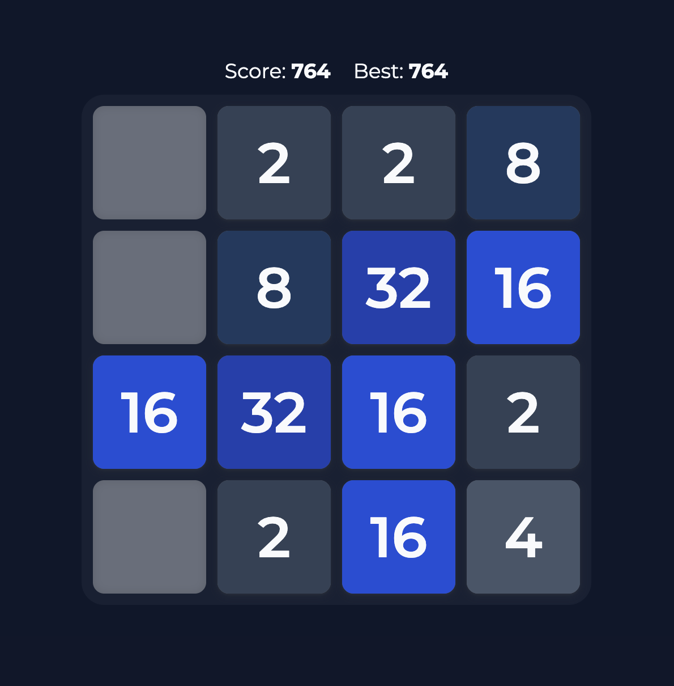

# 2048

An animated, responsive 2048 game built with Next.js and React. Move tiles with the keyboard or touch, merge matching numbers, and keep pushing past 2048 while your best score is saved locally.

[Live Demo](https://2048-pearl.vercel.app/) · [Report Issue](https://github.com/salimzeeshan/2048/issues)



## Highlights

- Smooth tile movement with merge and spawn animations
- Keyboard controls with arrow keys and WASD
- Swipe controls for mobile and touch devices
- Persistent best score using local storage
- Responsive board sizing for small and large screens
- Dark tile theme with styled high-value tiles
- Merge sound effect

## Tech Stack

| Tool | Purpose |
| --- | --- |
| Next.js | React framework and app runtime |
| React | UI state and rendering |
| CSS | Layout, responsive styling, and animations |

## Quick Start

```bash
npm install
npm run dev
```

Open `http://localhost:3000`.

If that port is already busy, Next.js will print the alternate local URL in your terminal.

## Controls

| Action | Input |
| --- | --- |
| Move up | `ArrowUp` or `W` |
| Move down | `ArrowDown` or `S` |
| Move left | `ArrowLeft` or `A` |
| Move right | `ArrowRight` or `D` |
| Mobile movement | Swipe |

## Gameplay

All tiles move together in the selected direction. When two tiles with the same value collide, they merge into one tile with double the value. After every valid move, a new tile appears. Reach `2048`, then keep going for a higher score.

## Scripts

```bash
npm run dev      # Start local development server
npm run build    # Create production build
npm run start    # Run production server
npm run lint     # Run Next.js lint command
```

## Project Structure

```text
src/
  components/
    GameCard.jsx             Game UI, input handling, score state, animations
  constants/
    numberToString.js        Tile value to CSS class mapping
  pages/
    index.js                 Home page
    _app.js                  App wrapper
    _document.js             Document shell
  styles/
    globals.css              Theme, layout, responsive board, animations
  utils/
    manipulate-slate.js      Board movement and validity helpers

public/
  audio/
    merge.mp3                Merge sound effect
    screenshot.png           README demo screenshot
```

## Build

```bash
npm run build
npm run start
```

## Notes

- Best score is stored in the browser with `localStorage`.
- The game is client-side and does not require a backend.
- The board logic and animation state are intentionally separated so the UI can animate tile movement while preserving correct 2048 rules.

---

Built by [Mohammad Zeeshan Salim](https://salimzeeshan.github.io/)
